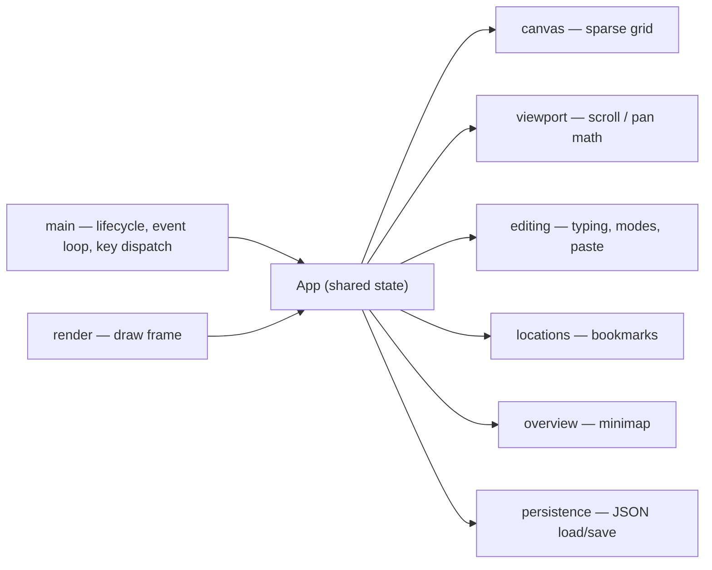

# terminal_pad

A terminal (TUI) text pad over an **infinite 2D canvas**. Paste and edit text
anywhere, navigate with the arrow keys, bookmark spots, and zoom out to a minimap
overview. Your canvas is saved to a plain JSON file.

Built in Rust with [`ratatui`](https://ratatui.rs) (rendering),
[`crossterm`](https://docs.rs/crossterm) (input/terminal), and `serde`
(persistence). Ships as a single self-contained binary.

## Features

- **Infinite canvas** — write at any coordinate, in any direction; only written
  cells use memory.
- **Navigation** — arrows move the cursor (the view follows); **Shift+arrow**
  pans the view by ⅓ of a screen, carrying the cursor with it (reversible).
- **Editing** — type to insert; **Ctrl+I** toggles Insert/Overwrite;
  Backspace/Delete/Enter.
- **Paste** — bracketed paste drops a block at the cursor, preserving lines
  (CR / CRLF / LF all handled).
- **Bookmarks** — nine slots: **Ctrl+1..9** jump, **Ctrl+Shift+1..9** save the
  current cursor *and* view.
- **Overview** — **Ctrl+Z** zooms out to a density minimap with your current view
  drawn as a box; arrows pan a screenful at a time for quick navigation.
- **Persistence** — **Ctrl+S** saves; also auto-saves on clean exit. Atomic
  writes (temp file + rename).

## Install

Requires the Rust toolchain. If you don't have it:

```sh
curl --proto '=https' --tlsv1.2 -sSf https://sh.rustup.rs | sh
```

Then build:

```sh
cargo build --release
# binary at target/release/terminal_pad
```

## Usage

```sh
terminal_pad [FILE]      # defaults to ./canvas.tpad
```

During development:

```sh
make run                 # cargo run (uses ./canvas.tpad)
cargo run -- notes.tpad  # open a specific file
```

A missing file starts a fresh canvas. A malformed file aborts with an error
(it is never overwritten).

## Keybindings

| Key | Action |
|-----|--------|
| Arrows | Move cursor (view follows) |
| Shift+Arrows | Pan view ⅓ screen (cursor moves too) |
| Ctrl+I | Toggle Insert / Overwrite |
| Backspace / Delete | Delete before / under cursor |
| Enter | New line (returns to the line's start column) |
| Ctrl+1 … Ctrl+9 | Jump to bookmark 1–9 |
| Ctrl+Shift+1 … Ctrl+Shift+9 | Save bookmark 1–9 |
| Ctrl+Z | Toggle zoom-out overview (arrows pan there) |
| Ctrl+S | Save |
| Esc / Ctrl+Q | Quit (auto-saves) |

### Terminal note

`Ctrl+I` and the `Ctrl+digit` bindings rely on the
[Kitty keyboard protocol](https://sw.kovidgoyal.net/kitty/keyboard-protocol/) to
report their modifiers, which the app enables when supported. Use
**kitty / WezTerm / Ghostty / recent iTerm2** for these to work reliably; in
plain macOS Terminal.app, `Ctrl+I` registers as Tab and `Ctrl+digit` may not be
distinguishable. `Ctrl+Z`, `Ctrl+S`, arrows, and editing work everywhere.

## File format

A `.tpad` file is JSON: a version, the written cells, the nine bookmark slots,
and the cursor.

```json
{
  "version": 1,
  "cells": [ { "x": 0, "y": 0, "c": "H" } ],
  "slots": [ null, { "cursor": [40, 12], "origin": [38, 10] }, null, ... ],
  "cursor": [0, 0]
}
```

## Architecture

Feature-first: each feature is a module with its own co-located `CLAUDE.md`
contract. Shared state lives on `App`; `main` owns the terminal lifecycle and the
event loop.



## Development

```sh
make            # list targets
make test       # run the test suite
make lint       # rustfmt --check + clippy -D warnings
make fmt        # format
make release    # optimized build
```

## Limitations (v1)

- One Unicode scalar per cell: single-width text (Latin, Cyrillic, Greek, …)
  works; **wide glyphs (CJK) and multi-codepoint emoji** (ZWJ sequences, flags,
  skin-tone modifiers, combining marks) misalign or split.
- No undo/redo yet.
