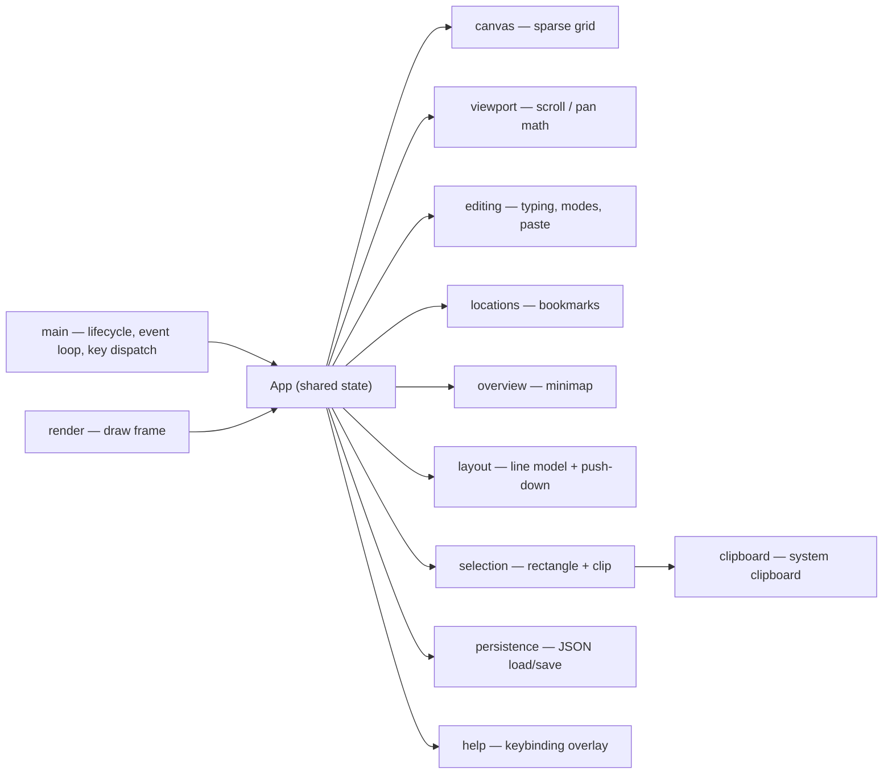

<a href="https://claude.ai"></a>

# terminal_pad

A terminal (TUI) text pad over an **infinite 2D canvas**. Paste and edit text
anywhere, navigate with the keyboard or mouse, select/copy/paste rectangles,
bookmark spots, and zoom out to a minimap overview. Your canvas is saved to a
plain JSON file.

Built in Rust with [`ratatui`](https://ratatui.rs) (rendering),
[`crossterm`](https://docs.rs/crossterm) (input/terminal), `serde`
(persistence), and [`arboard`](https://docs.rs/arboard) (system clipboard).
Ships as a single self-contained binary.

## Features

- **Infinite canvas** — write at any coordinate, in any direction; only written
  cells use memory.
- **Navigation** — arrows move the cursor (the view follows); **Shift+arrow**
  pans the view by ⅓ of a screen, carrying the cursor with it (reversible);
  **Option/Alt+Left/Right** jump a word.
- **Editing** — type to insert; **Ctrl+I** toggles Insert/Overwrite;
  Backspace/Delete. **Enter** splits the line at the cursor — the trailing words
  (a run joined by single spaces) move down to the line's start, pushing the
  block(s) below down to make room.
- **Mouse** — click to position the cursor, **drag to select a rectangle**, and
  scroll-wheel to pan.
- **Selection** — copy a selected block with **Ctrl+C** (to an internal buffer
  *and* the system clipboard), paste it with **Ctrl+V**, clear it with
  Delete/Backspace, cancel with Esc.
- **Paste** — bracketed paste drops a block at the cursor, preserving lines
  (CR / CRLF / LF all handled).
- **Bookmarks** — nine slots: **Ctrl+1..9** jump, **Ctrl+Shift+1..9** save the
  current cursor *and* view.
- **Overview** — **Ctrl+Z** zooms out to a density minimap with your current view
  drawn as a box; arrows pan a screenful (Shift+arrow ⅓) for quick navigation.
- **Help** — **Ctrl+H** shows a keybinding cheat sheet; any key dismisses it.
- **Persistence** — **Ctrl+S** saves; also auto-saves on clean exit. Atomic
  writes (temp file + rename). Named central pads via `--name` (see Usage).

## Install

### Prebuilt binary (macOS / Linux)

```sh
curl --proto '=https' --tlsv1.2 -LsSf \
  https://github.com/epatel/terminal_pad/releases/latest/download/terminal_pad-installer.sh | sh
```

On macOS, a downloaded binary may be quarantined by Gatekeeper. If you see
"cannot be verified", clear the flag once:

```sh
xattr -d com.apple.quarantine "$(command -v terminal_pad)"
```

### From source

Requires the Rust toolchain (`curl --proto '=https' --tlsv1.2 -sSf https://sh.rustup.rs | sh`):

```sh
cargo build --release   # or: make release
# binary at target/release/terminal_pad
```

## Usage

```sh
terminal_pad [FILE]          # a pad file; defaults to ./canvas.tpad
terminal_pad --name notes    # a central pad, reachable from any directory:
                             #   ($XDG_DATA_HOME or ~/.local/share)/terminal_pad/notes.tpad
terminal_pad --name notes --clear   # open that pad starting empty
terminal_pad --help          # full usage
terminal_pad --version       # print the version
```

`--name` and a positional `FILE` are mutually exclusive. `--clear` starts from
an empty canvas; the cleared state is written on exit / Ctrl+S.

During development:

```sh
make run                 # cargo run (uses ./canvas.tpad)
cargo run -- notes.tpad  # open a specific file
cargo run -- --name scratch   # a named central pad
```

A missing file starts a fresh canvas. A malformed file aborts with an error
(it is never overwritten) — unless `--clear` is given, which ignores existing
contents.

## Keybindings

| Key | Action |
|-----|--------|
| Arrows | Move cursor (view follows) |
| Shift+Arrows | Pan view ⅓ screen (cursor moves too) |
| Option/Alt+Left/Right | Jump a word back / forward |
| Ctrl+I | Toggle Insert / Overwrite |
| Backspace / Delete | Delete before / under cursor |
| Enter | Split the line at the cursor — trailing words move down to the line's start, pushing blocks below down |
| Ctrl+1 … Ctrl+9 | Jump to bookmark 1–9 |
| Ctrl+Shift+1 … Ctrl+Shift+9 | Save bookmark 1–9 |
| Ctrl+Z | Toggle zoom-out overview (Shift+arrows pan ⅓ there) |
| Ctrl+H | Toggle the keybinding cheat sheet |
| Ctrl+S | Save |
| Esc / Ctrl+Q | Quit (auto-saves) |
| Mouse click | Position the cursor |
| Mouse drag | Select a rectangle |
| Scroll wheel | Pan the view up / down |
| Ctrl+C / Ctrl+V | Copy selection (+ system clipboard) / paste block |
| Delete / Backspace | Clear the selection (when one is active) |
| Esc | Cancel the selection |

### Terminal note

`Ctrl+I` and the `Ctrl+digit` bindings rely on the
[Kitty keyboard protocol](https://sw.kovidgoyal.net/kitty/keyboard-protocol/) to
report their modifiers, which the app enables when supported. Use
**kitty / WezTerm / Ghostty / recent iTerm2** for these to work reliably; in
plain macOS Terminal.app, `Ctrl+I` registers as Tab and `Ctrl+digit` may not be
distinguishable. `Ctrl+Z`, `Ctrl+S`, arrows, the mouse, and editing work
everywhere. `Option+Arrow` word jump needs the same protocol (some terminals
otherwise send `ESC b`/`ESC f`). Capturing the mouse takes over the terminal's
own click-to-select/copy — hold **Shift** (or **Option**) for native selection.

## File format

A `.tpad` file is JSON: a version, the written cells, the nine bookmark slots,
and the cursor.

```json
{
  "version": 1,
  "cells": [ { "x": 0, "y": 0, "c": "H" } ],
  "slots": [ null, { "cursor": [40, 12], "origin": [38, 10] }, null, ... ],
  "cursor": [0, 0]
}
```

## Architecture

Feature-first: each feature is a module with its own co-located `CLAUDE.md`
contract. Shared state lives on `App`; `main` owns the terminal lifecycle and the
event loop.



## Development

```sh
make            # list targets
make test       # run the test suite
make lint       # rustfmt --check + clippy -D warnings
make fmt        # format
make release    # optimized build
```

## Limitations (v1)

- One Unicode scalar per cell: single-width text (Latin, Cyrillic, Greek, …)
  works; **wide glyphs (CJK) and multi-codepoint emoji** (ZWJ sequences, flags,
  skin-tone modifiers, combining marks) misalign or split.
- No undo/redo yet.
