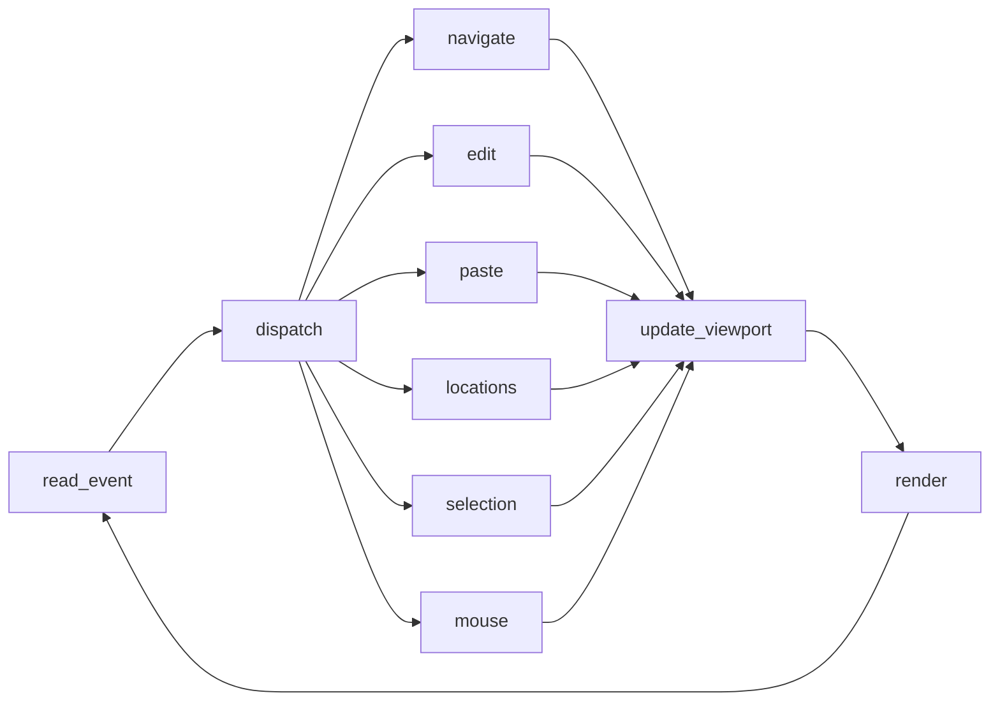

# architecture

System topology and per-frame pipeline for terminal_pad — an infinite-canvas TUI text pad (Rust + ratatui + crossterm + serde).

## Shape
Single self-contained binary. One process, one synchronous event loop, no threads required for v1. State lives entirely in memory and is serialized to a file on save/load.

## Data model
- **Canvas** — an infinite 2D grid of characters. Stored sparsely: `HashMap<(i64, i64), char>` keyed by absolute `(x, y)` cell coordinates. Only written cells consume memory; unwritten cells render as blank. No fixed bounds in any direction.
- **Cursor** — an absolute `(x, y)` position on the canvas (may sit on an empty cell).
- **Viewport** — the top-left absolute `(x, y)` of the rectangle currently drawn, plus the terminal's width/height in cells. The viewport scrolls over the canvas; the cursor stays visible (cursor-follow).
- **Mode** — `Insert` or `Overwrite`, toggled by Ctrl+I.
- **Locations** — array of 9 optional bookmarks, indexed 0–8, each holding a cursor + viewport origin; bound to Ctrl+1..9 (jump) / Ctrl+Shift+1..9 (save).
- **Selection** — an optional rectangle (two canvas corners) from left-click-drag, plus an internal clip buffer for copy/paste.

## Per-frame pipeline
The loop is a feature-first pipeline of named nodes. Each node has conceptual `before`/`after` hook points other features can attach to (observe / modify / short-circuit / side-effect).

- **read_event** — block on a crossterm event (key, mouse, paste, resize). Bracketed paste and mouse capture are enabled, so a paste arrives as one `Event::Paste(String)` and clicks/drags/wheel as `Event::Mouse`.
- **dispatch** — route the event to exactly one handler based on key/modifiers (or mouse kind).
- **navigate** — arrows move the cursor by 1 cell; Shift+arrows jump the viewport by 1/3 of its width/height; Alt+Left/Right jump by a word.
- **edit** — printable keys write a char at the cursor (Insert shifts the row's trailing cells right; Overwrite replaces in place); Backspace/Delete handled here; Ctrl+I toggles mode. **Enter splits the line** at the cursor (the trailing single-space-joined run moves down to the line's start, pushing blocks below down — `layout`).
- **paste** — insert a pasted block anchored at the cursor (bracketed paste, or the internal clip via Ctrl+V).
- **locations** — Ctrl+1..9 jump the view/cursor to bookmark N; Ctrl+Shift+1..9 store the current location into slot N.
- **selection** — Ctrl+C copies the rectangle (internal buffer + system clipboard), Del/Bksp clears it, Esc cancels.
- **mouse** — left-click positions the cursor, click-drag paints a selection rectangle, the scroll wheel pans the view.
- **update_viewport** — recompute viewport origin so the cursor remains visible; clamp scroll math.
- **render** — paint the visible canvas window + cursor (and any selection highlight) to the terminal via ratatui.

## Feature → directory map
- `src/canvas/` — sparse grid + edit ops (the model)
- `src/viewport/` — scroll math, cursor-follow, scroll-wheel pan
- `src/editing/` — cursor, insert/overwrite, paste insertion, word jump
- `src/locations/` — Ctrl+1..9 bookmarks (cursor + view)
- `src/persistence/` — load/save canvas + bookmarks (serde_json)
- `src/render/` — ratatui drawing (incl. selection highlight)
- `src/overview/` — Ctrl+Z zoomed-out minimap
- `src/layout/` — the "line" model + Enter's make-room push-down
- `src/help/` — Ctrl+H keybinding cheat-sheet overlay
- `src/selection/` — click-drag rectangle model + copy/paste/clear
- `src/clipboard.rs` — system-clipboard wrapper (arboard); single file, no dir
- `src/app.rs` — shared state (canvas, viewport, cursor, mode, bookmarks, zoom, help, selection, clip, path)
- `src/main.rs` — terminal lifecycle (raw mode, alt screen, mouse capture, panic-safe restore) + CLI parsing + the loop above

Each feature directory has its own co-located `CLAUDE.md` (the single-file `clipboard` is documented inline + in `selection/CLAUDE.md`).

## Deployment
`cargo build --release` → one binary. No runtime, no external services. Persistence is a single local file.
