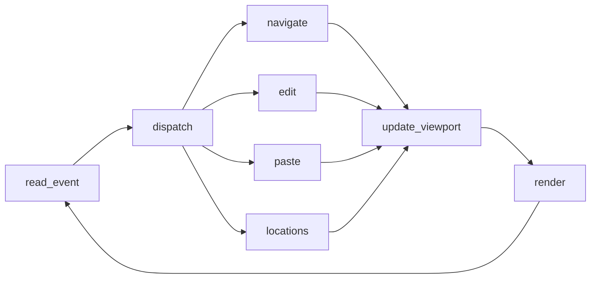

# architecture

System topology and per-frame pipeline for terminal_pad — an infinite-canvas TUI text pad (Rust + ratatui + crossterm + serde).

## Shape
Single self-contained binary. One process, one synchronous event loop, no threads required for v1. State lives entirely in memory and is serialized to a file on save/load.

## Data model
- **Canvas** — an infinite 2D grid of characters. Stored sparsely: `HashMap<(i64, i64), char>` keyed by absolute `(x, y)` cell coordinates. Only written cells consume memory; unwritten cells render as blank. No fixed bounds in any direction.
- **Cursor** — an absolute `(x, y)` position on the canvas (may sit on an empty cell).
- **Viewport** — the top-left absolute `(x, y)` of the rectangle currently drawn, plus the terminal's width/height in cells. The viewport scrolls over the canvas; the cursor stays visible (cursor-follow).
- **Mode** — `Insert` or `Overwrite`, toggled by F11.
- **Locations** — array of 10 optional `(x, y)` bookmarks, indexed 0–9, bound to F1–F10.

## Per-frame pipeline
The loop is a feature-first pipeline of named nodes. Each node has conceptual `before`/`after` hook points other features can attach to (observe / modify / short-circuit / side-effect).

- **read_event** — block on a crossterm event (key, paste, resize). Bracketed paste is enabled so a paste arrives as one `Event::Paste(String)`, not a keystroke flood.
- **dispatch** — route the event to exactly one handler based on key/modifiers.
- **navigate** — arrows move the cursor by 1 cell; Shift+arrows jump the viewport by 1/3 of its width/height.
- **edit** — printable keys write a char at the cursor (Insert shifts the row's trailing cells right; Overwrite replaces in place); Backspace/Delete/Enter handled here; F11 toggles mode.
- **paste** — insert a pasted block anchored at the cursor.
- **locations** — F1–F10 jump the view/cursor to bookmark N; Shift+F-key stores the current location into slot N.
- **update_viewport** — recompute viewport origin so the cursor remains visible; clamp scroll math.
- **render** — paint the visible canvas window + cursor to the terminal via ratatui.

## Feature → directory map (target layout, once scaffolded)
- `src/canvas/` — sparse grid + edit ops (the model)
- `src/viewport/` — scroll math, cursor-follow
- `src/editing/` — cursor, insert/overwrite, paste insertion
- `src/locations/` — F1–F10 bookmarks
- `src/persistence/` — load/save canvas + bookmarks (serde_json)
- `src/render/` — ratatui drawing
- `src/main.rs` — terminal lifecycle (raw mode, alt screen, panic-safe restore) + the loop above

Each feature directory gets its own co-located `CLAUDE.md` once code lands; until then the feature cards under `cards/` hold the contracts.

## Deployment
`cargo build --release` → one binary. No runtime, no external services. Persistence is a single local file.
